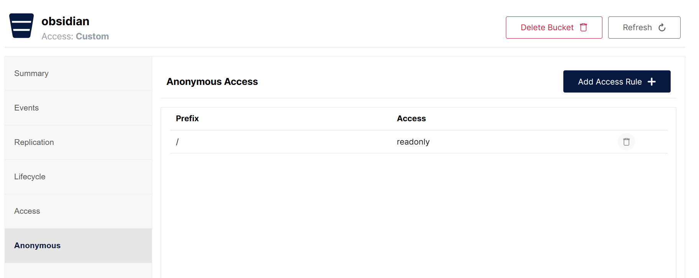

# Obsidian Minio Uploader Plugin

### [English](./README.md) | 中文

将图片、视频、音频、PDF等文件上传到 Minio OSS 中，而不是复制到本地。减少本地磁盘占用大小，提高多设备之间同步的效率。

## 演示

可以搭配 [Editing ToolBar](https://github.com/PKM-er/obsidian-editing-toolbar) 插件使用，将 minio 命令添加到操作栏中，可以点击选择文件后上传并添加到 Obsidian 文档中.

## 特性

- 支持拖拽文件到编辑器后直接上传到 Minio
- 支持粘贴文件到编辑器后直接上传到 Minio
- 支持命令选择文件后上传到 Minio, 配合 Editing ToolBar 插件使用更便捷

## 设置

首先，Minio 相关得配置都必须先正确配置后才可以正常使用：

> 提示：端口号为 Minio 的API数据访问端口号

- accessKey
- secretKey
- bucket
- endpoint
- port
- SSL

其次，需要在 Minio 控制台的 Bucket 设置中开启文件匿名访问能力，即通过URL可直接访问文件。

## 感谢

本项目从 [S3 image uploader](https://github.com/jvsteiner/s3-image-uploader) \ [Editing ToolBar](https://github.com/PKM-er/obsidian-editing-toolbar) 插件中获得灵感.
